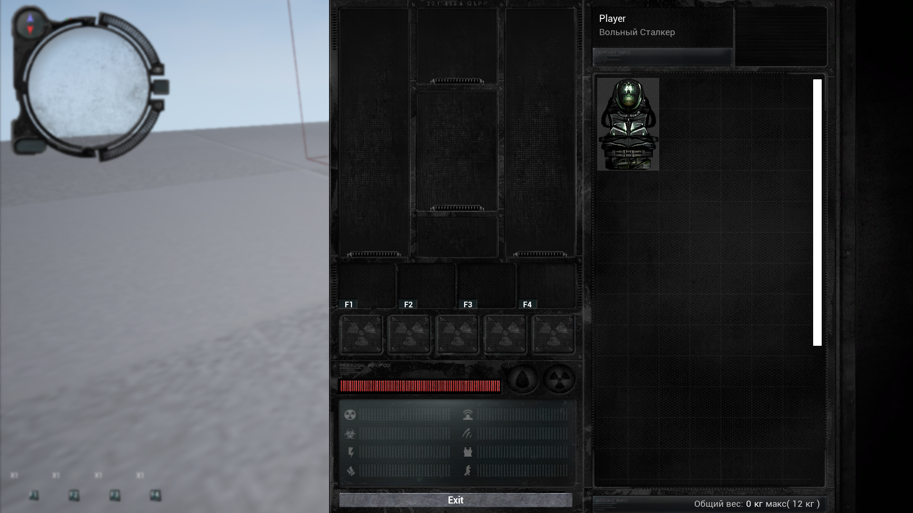
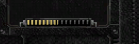

## Introduction
Inventory system from S.T.A.L.K.E.R.: Call of Pripyat with all the basic mechanics on UE4 with 4 GUI. In addition to the basic features, a system for developing weapon mechanics has been prepared. 

## Overview


## Requirement
These requirements must be met before you start: <br>
Before you start, if your version of Unreal Engine is less than 4.27, install it at this link [Unreal Engine 4.27](https://www.epicgames.com/site/en-US/news/unreal-engine-4-27-is-now-available)


## Getting Started
1. Install the required version of the engine (if required)
2. Select the folder to clone the project
3. Open GitBush and write this command
```
git clone https://github.com/shulgastanslv/inventory-system.git
```
or you can do it with the IDE you are working in.


## The main functions that have been implemented:

* Armor Characteristics System when equipped. There is also a system that shows the performance of these characteristics. In this project you can find an area with radiation to check the characteristic of resistance to radiation.
The system of adding new characteristics to the surrounding factors has also been added.


* A system of item states has been implemented. In the project there is a special list that can have a state.



* The logic of moving items in the inventory. And blocking when moving an item to an item. The item will be moved to the closest inventory cell.


* Characteristics system and armor combination. We have several slots present. And we can equip two weapons. Helmet, Outfit.


* Also fast slots have been implemented. And developed a system of using items by pressing certain keys.


## Restrictions
Inventory can be extended with new functions, logic, etc. But you should expect that when adding new items, you need to remember to have a list of items for this.
You can see the file: `Content\Inventory\Structures\S_ItemDetails`.<br>

In addition, the project has not implemented a system of weight of items for the UI. You can see the weight system in this component: `Content\Inventory\Components\InventoryComponent`.<br>
But for it to work correctly it must be implemented in the inventory UI itself: `Inventory\UI\WB_Inventory`


## License
This project is licensed with the [MIT license](LICENSE.txt).