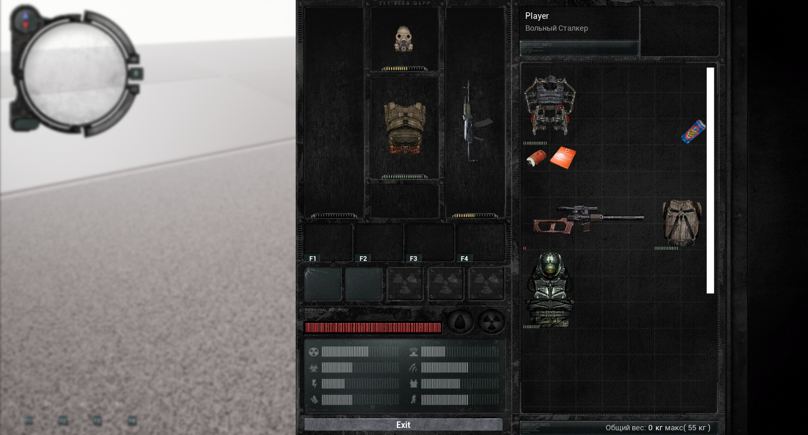

## Introduction
Inventory system from stalker zov pripyati with all the basic mechanics on Unreal Engine 4. In addition to the basic mechans, a system for developing weapon mechans is prepared. 
This project is also minimally optimized.

## Overview



## Requirement
These requirements must be met before you start: <br>
Before you start, if your version of Unreal Engine is less than 4.27, install it at this link [Unreal Engine 4.27](https://www.epicgames.com/site/en-US/news/unreal-engine-4-27-is-now-available)


## Getting Started
1. Install the required version of the engine (if required)
2. Select the folder to clone the project
3. Open GitBush and write this command
```
git clone https://github.com/akiroqw/inventory_system.git
```
or you can do it with the IDE you are working in.


